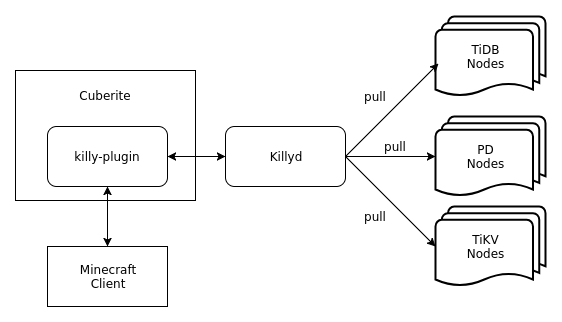

<h1 align="center">
        <br>
        
        <br>
        <h4 align="center">Play TiDB in Minecraft!</h4>
        <br>
</h1>

<p align="center">
    <a href="https://travis-ci.org/prism-river/killy"></a>
	<a href="https://goreportcard.com/report/github.com/prism-river/killy"></a>
	<a href="https://godoc.org/github.com/prism-river/killy"></a>
	<a href="https://libraries.io/github/prism-river/killy"></a>
</p>

## Features Preview
 
### TiDB Cluster Status

<div align="center">
	
</div>

### Table Status

<div align="center">
	
</div>

### Query in Minecraft

<div align="center">
	
</div>

## Instructions

```bash
cp -r config/* Server/
git clone https://github.com/prism-river/killy-plugin Killy
cp -r Killy Server/Plugins/
make
./build/killyd -config=example.toml
cd ./Server
./Cuberite
```

## API Specification

### TCP Messages

```go
// TCPMessage defines what a message that can be
// sent or received to/from LUA scripts
type TCPMessage struct {
	Cmd  string   `json:"cmd,omitempty"`
	Args []string `json:"args,omitempty"`
	// Id is used to associate requests & responses
	ID   int         `json:"id,omitempty"`
	Data interface{} `json:"data,omitempty"`
}
```

#### 监控

cmd == 'monitor'

#### 数据库

cmd == 'event' and args == ['table']

## Architecture

<div align="center">
	
</div>

## Acknowledgments

* Thanks [github.com/docker/dockercraft](https://github.com/docker/dockercraft) for its awesome idea.
